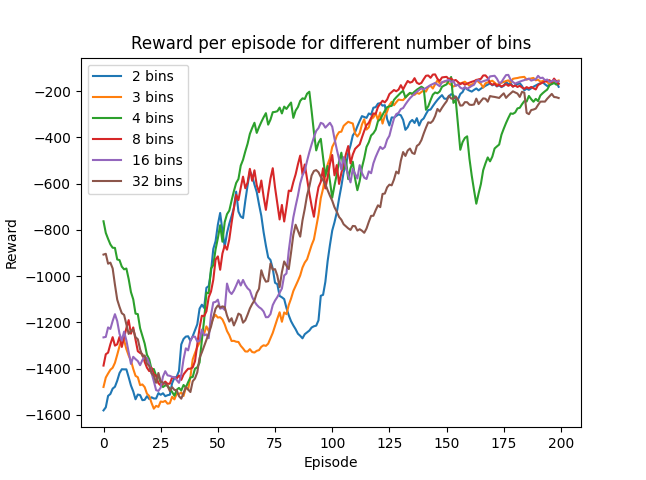
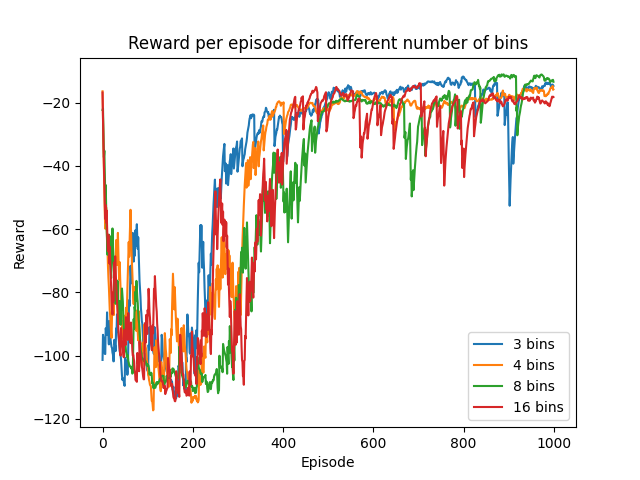

## MultiAction Reinforcement Learning agent

This repo contains an agent for MultiAction Reinforcement Learning. It can be used when the action is discrete (hence a gym.spaces.MultiDiscrete action space) or when the action is continuous (hence a gym.spaces.Box action space).

If the action is continuous, the Environment Wrapper will dicretize the action space. Each action value will be divided into nb_bin discrete values. It has been proven that this method works quite well compared to conventional continuous action RL methods such as DDPG [here](https://arxiv.org/pdf/1711.08946.pdf).
The agent is using Branching DQN to allow Q-learning with multiple actions and can be used on almost any environment.
#Installation
Please install the dependencies by running the following command with pip:
```
pip install -r requirements.txt
```

# Performance

This agent was used to train the [Pendulum-v1](https://gym.openai.com/envs/Pendulum-v1/) environment. Its results for different number of bins are 

It was also trained on [Bipedal Walker-v3](https://gym.openai.com/envs/BipedalWalker-v3/) environment. Its results for different number of bins are


